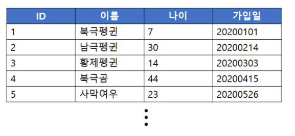
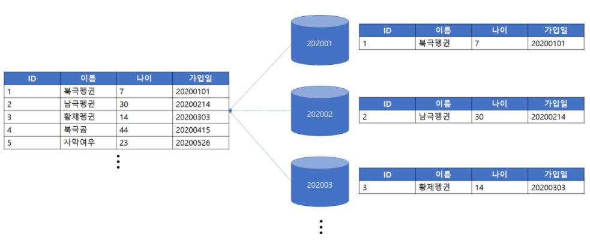
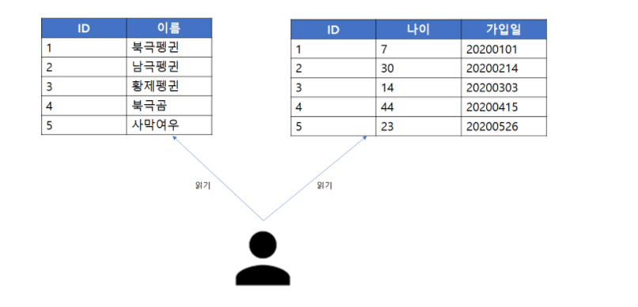
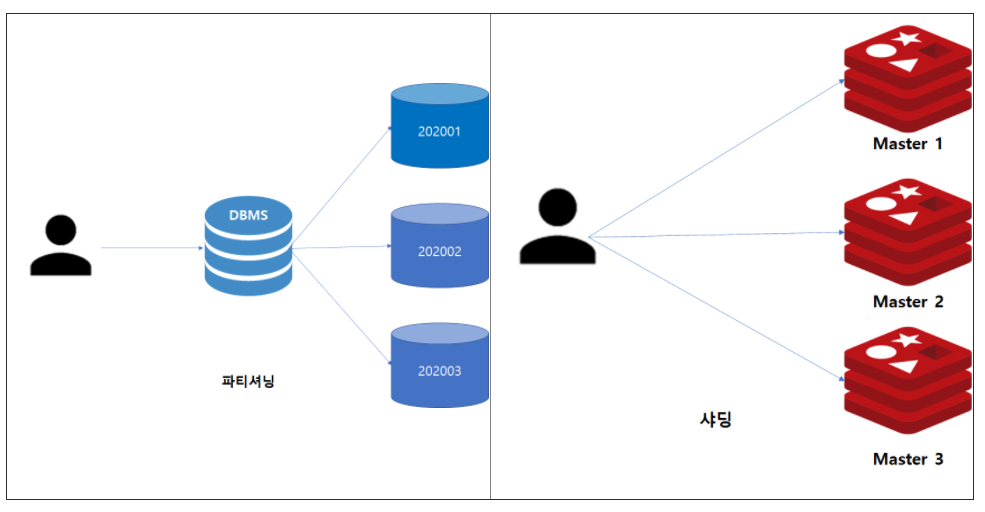

### 파티셔닝 개념

파티셔닝은 DB의 관리용이성 및 읽기 최적화를 위해 논리적인 테이블의 물리 구조를 여러개의 파티션으로 분할하여 분산 저장하는 기법.

위 그림과 같은 회원 테이블이 존재한다고 생각해본다. 이때 가입자가 매일 증가하여 테이블 크기가 점점 커진다면, 해당 테이블의 조회 성능을 높이기 위한 인덱스 추가 등의 작업이 쉽지 않을 뿐더러 조회 성능도 점차 떨어지게 된다.

가령 수십억건의 데이터가 존재하는 테이블에서 매월마다 가입일이 5년 지난 데이터를 삭제해야 한다면, 데이터를 지우기 위해 모두 탐색하면서 조건에 해당하는 데이터를 삭제해야 한다.

삭제시 오랜시간 Lock으로 인해 동시성 저하가 발생할 수 있으며, 테입르 크기가 점점 더 커질수록 해당 작업은 어려워진다.

인덱스가 있더라도 디스크 Random I/O로 인해 좋은 성능이 나오지 않을 뿐더러 데이터 지속 삭제로 인해 **인덱스 Sparse 현상**이 발생할 수 있다.

[DB 개념 참고 링크](http://www.dbguide.net/db.db?cmd=view&boardUid=148220&boardConfigUid=9&categoryUid=216&boardIdx=140&boardStep=1)

이런 경우, 사용자에게 논리적으로 보여지는 테이블은 하나지만 물리적으로는 여러 파티션에 데이터를 나누어 저장한다면 조회 성능 향상 및 관리가 용이해진다.

위 그림은 가입일 기준으로 월로 구분하여 파티션을 구성하였다.

**해당 파티셔닝에 따른 장점**

1. 월 가입일 기준으로 데이터를 삭제할 경우, 기존에는 테이블 내 모든 데이터를 탐색해야했으나 지금은 특정 월에 해당하는 파티션만 Drop 하면 되므로 작업부담 감소.
2. 특정 월에 해당하는 데이터 조회 시, 해당 파티션에 속한 데이터에 대해서만 Multi block I/O 실시할 수 있어 인덱스보다 빠른 조회가 가능할 수 있음.

`파티셔닝은 대용량의 논리적 구조를 물리적 파티션으로 분할하여 조회 및 관리 용이성을 위해 사용됨`

---

### 파티셔닝 종류

1. **수평적 파티셔닝**  
   `특정 데이터 기준`으로 데이터를 다른 파티션에 저장하는 방법.
2. **수직적 파티셔닝**  
     
   `특정 컬럼을 기준`으로 데이터를 분할하는 방법  
   위 그림과 같이 기존 회원 테이블을 특정 컬럼을 기준으로 2개의 파티션으로 분할한 경우.  
   수직적 파티셔닝의 이점은 한쪽 세그먼트에서 발생하는 DML이 다른쪽에 영향을 끼치지 않는다. 반면 레코드 전체를 읽어야할 경우에는 데이터가 물리적으로 분산되었으므로 I/O에서 다소 비효율이 발생.

3. **샤딩**  
     
   `수평적 파티셔닝의 한 종류`이다.  
   수평적 파티셔닝과 비교하여 차이점은 `파티셔닝`은 `단일 DBMS내에서의 분할 정책`이고, `샤딩`은 `분할된 여러 데이터베이스 서버로 데이터를 분할하는 방법`이다.

   따라서 샤딩을 구성할 경우, 샤드의 수만큼 노드가 존재하고 서버가 여러대 존재하므로 부하를 적절히 분산할 수 있는 장점이 있다.

용량을 고려하여 데이터 크기를 분할할 때, 수직적 파티션보다는 수평적 파티션이 분배에 용이하다.
