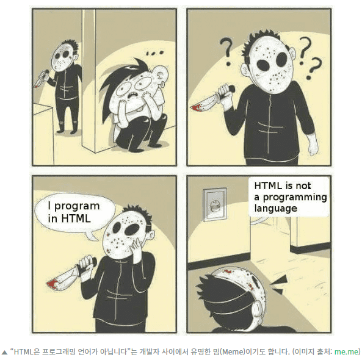
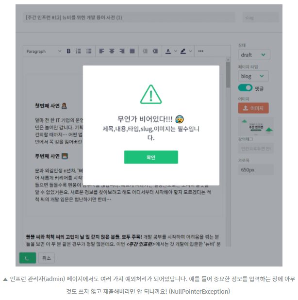
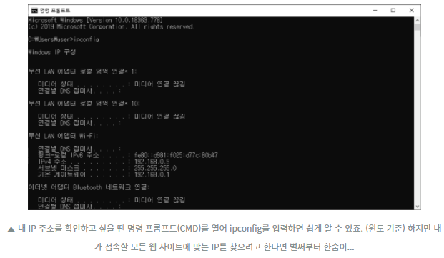

### 프론트엔드 개발자(FrontEnd Developer)

웹 브라우저를 통한 웹 서비스의 앞단을 담당하는 개발자. 클라이언트/서버 기준으로 웹 페이지 화면을 비롯한 클라이언트 영역을 프론트 엔드라고 한다.

### 백엔드 개발자(BackEnd Developer)

웹 서비스의 뒷단을 담당하는 개발자. 주로 유저에게 보이지 않는 DB와 API로 이루어진 서버 영역을 관리 개발한다.

### 풀스택(Full Stack)

프론트 엔드와 백엔드 개발영역을 통틀어 다룰 수 있는 개발자. 희귀종, 유니콘, 일당백이 될 수도 있지만 빈 스택(Empty Stack)이 될 수 도 있다.

### 프레임워크(Framework)

프로그램을 개발하기 위한 구조를 제공하는 개발 환경. 코딩 할때 자주 쓰이는 여러 클래스(Class, 변수와 함수의 묶음)를 프레임워크가 정해둔 흐름에 맞춰 쓸 수 있도록 지원해 주기 때문에 복잡하거나 반복되는 작업에 대한 부담을 덜어줄 뿐만 아니라 개발에 들이는 시간 대비 질을 높일 수 있다.  
[ex] 자바스크립트에서는 뷰(Vue.js), 앵귤러(Angular) / 자바에서는 스프링(Spring) - 웹 프레임워크

### 라이브러리(Library)

프로그램을 개발하는 데 필요한 여러 기능을 활용할 수 있도록 묶어놓은 함수 또는 기능의 집합. 프레임 워크는 개발을 제어하는 틀을 제공해준다면, 라이브러리는 개발자가 필요한 기능을 마음대로 가져다 쓸 수 있는 일종의 모음집에 가깝다. 정해진 방식으로 개발을 하게끔 정해주는 프레임워크와 달리 제어권이 개발자에게 주어지는 셈.  
[ex] 자바스크립트에서의 리액트(React), 제이쿼리(jQuery)

### 플러그인(Plug-in)

어떤 특정한 기능을 해결하는 데 쓸 수 있도록 미리 만들어 놓은 코드 및 데이터의 모음. 한 라이브러리나 프레임워크에서 여러개의 플러그인을 제공한다고 볼 수 있다.

### 웹 퍼블리셔(Web Publisher)

디자인 시안에 맞춰 웹 화면을 구현하는 웹 퍼블리싱(Web Publishing)을 담당하는 직무로 한국에서만 쓰인다. 프론트엔드 개발에서 웹 화면과 관련한 시각적인 면을 담당하는 개념을 떼놓은 것.
디자인은 물론 웹 표준과 호환성을 고려해 코딩을 진행하고 디자이너와 프론트 엔드 개발자 사이에서 의견을 조율하기도 한다. 주로 HTML과 CSS, jQuery, Bootstrap 같은 라이브러리나 프레임워크까지 사용하는 편. 마크업 언어인 HTML, CSS를 다루기 떄문에 마크업 개발자라고도 한다.  
같은 퍼블리셔라고 해도 회사마다, 담당하는 일마다 일의 범위가 제각기 다르다. 어떤 회사에서는 프론트엔드 개발자가 퍼블리싱까지 담당하지만 웹 퍼블리셔를 따로 두거나, 디자이너가 웹 퍼블리싱까지 맡는 경우도 많다.

### 마크업 언어(Markup Language)

태그 등을 이용해 문서나 데이터의 구조를 표시한 언어. 프로그래밍 언어와는 다르며 HTML, CSS, XML이 대표적인 마크업 언어다.

### 웹 접근성(Web Accessibility)

누구에게나 평등한 웹 환경을 구성하는 요소. 웹 표준을 지킴으로써 장래를 가진 사람, 고령자, 어린이들이 다른 유저들과 마찬가지로 웹에서 제공하는 정보를 원활하게 이용할 수 있도록 보장하는 것.  
[ex] 시각장애인을 위한 대체 텍스트 기능 및 키보드만으로 서비스의 모든 기능을 사용할 수 있도록 하는 것

### 검색 엔진 최적화(Search Engine Optimize)

줄여서 SEO라고 부르며, 웹 페이지를 구글 등 검색엔진이나 포털사이트의 기준에 맞춰 구성하는 작업. 사람들이 많이 검색할 만한 키워드를 배치하고, 웹 표준을 지키며, 스팸으로 분류되지 않게끔 하는 등 웹 페이지 링크가 더 많이 노출되도록 처리한다.  
온라인 마케팅의 필수 요소로도 꼽히는데, SEO가 잘 적용된 페이지는 검색 시 상단에 오를 수 있기 때문이다.

### 버그(Bug)

소프트웨어에서 발생하는 예견치 못한 오류나 오작동. 없어도 이상하고 있어도 이상한 것.

### 에러(Error)

잘못 짠 코드처럼 내부 문제로 예상하지 못한 문제가 일어나는 버그와 달리, 외부에 있는 유저가 오탈자를 내거나 띄어쓰기를 실수하는 등 내부에서 정한 형식을 따르지 않을때 주로 발생한다.  
[ex] 숫자만 적도록 되어있는 주민번호 입력창에 문자를 적었을 경우

### 예외(Exception)

에러가 일어날 가능성을 개발자가 미리 예상하고 프로그램이 비정상적으로 종료되지 않도록 하는 것. 예외 처리(Exception Handling) 또는 트러블 슈팅(Trouble Shooting)을 통해 예외를 구분하고 유저에게 문제를 바로잡아달라는 에러 메시지를 띄워줘야 에러로 인한 문제를 예방할 수 있다.

### 트래픽(Traffic)

서버를 통해 전송되는 데이터의 양. 서비스 방문자 수가 많을수록, 접속이 잦아질수록 증가한다. 트래픽이 너무 높아지면 서버가 먹통이 된다.(Server Down)  
백엔드 개발자라면 시스템을 안정적으로 개발해 높은 트래픽에도 서비스 접근이 제한되지 않도록 유지하는 것이 관건이다.  
[ex] 수강신청에 서버가 `터져`버리거나, 외부에서 많은 PC를 감염시켜 의도적으로 특정 서비스가 마비되도록 공격하는 것(DDOS)

### 데이터베이스(Database)

줄여서 DB. 데이터의 집합. 서버를 통해 넘어오는 데이터를 저장하고 관리하는 일종의 창고 역할을 한다.
(데이터베이스에 과부하가 걸리면 서버에도 지장을 주고, 관리가 잘못되면 데이터가 날아갈 수 있다.)

### 데이터베이스 관리 시스템(Database Management System)

줄여서 DBMS. 말 그대로 데이터베이스를 통해 데이터를 저장,수정,추출할 수 있도록 관리하는 프로그램.
(MS의 액세스(Access)도 DBMS에 해당한다.)

### 관계형 데이터베이스(Relational DataBase)

데이터베이스에서 키(key)와 값(value)의 관계로 이루어진 표(table)로 데이터를 구성하는 방식. 줄여서 RDB.  
[ex] 오라클, MySQL, Microsoft SQL Server 등

### 쿼리(Query)

RDBMS에서 데이터를 요청하고 관리하기 위해서는 SQL(Structured Query Language, 구조화 쿼리 언어)라는 데이터베이스 언어를 써야 한다. SQL을 이용하면 데이터 베이스에 쿼리(Query), 즉 질의를 통해 원하는 조건에 맞는 데이터를 추출하거나 조작할 수 있다.
`관계형 데이터베이스에서 데이터를 조회, 추출, 조작하기 위해 쓰는 명령어 혹은 질의 자체`를 `쿼리`라고 한다.

### API(Application Programming Interface)

응용 프로그램 인터 페이스. 어떤 응용 프로그램에서 특정한 기능을 사용하기 위해 필요한 데이터를 주고받게끔 만든 도구나 방법을 뜻한다. API가 규격에 맞게 데이터를 요청하고 받아볼 수 있도록 하는 중간 창구 역할을 하는 셈.  
[ex] 포털사이트가 기상 관측 기업의 날씨 정보를 받아서 내보내는 것, 코로나 확진자 분포를 지도에 띄우는 것, 여러 웹사이트에서 페이스북이나 카카오톡 계정을 통한 간편 로그인을 제공하는 것

### 오픈소스(Open Source)

누구나 제한 없이 쓸 수 있는 소스 코드 혹은 소프트웨어. 오픈 소스로 배포된 코드는 열람, 수정, 복제, 재배포 등이 자유롭다.
한국에서는 [공공데이터포털](data.go.kr)을 통해 공개된 오픈 API를 내려 받을 수 있다.

### SDK(Software Development Kit)

소프트웨어나 시스템을 만드는 데 쓰이는 개발 도구 키트. SDK안에는 개발에 필요한 샘플 코드, 코드 편집기 같은 툴이나 콘솔, 안내 문서, API등이 포함된다.  
[ex] 안드로이드용 모바일 앱을 개발하는 데는 Android SDK, 자바 개발을 하는데는 JDK가 쓰인다.

### IDE(Integrated Development Environment)

프로그램을 개발하는 데 필요한 소스 코드 작성 및 편집, 컴파일, 디버깅 등 모든 작업을 한번에 할 수 있는 통합 개발 환경.  
[ex] 비주얼 스튜디오(Visual Studio), 이클립스(Eclipse), 인텔리제이(IntelliJ) 등

### 유닉스(Unix)

기계어에 가까운 언어인 어셈블리어로 개발한 컴퓨터 운영 체제. 주로 서버 개발이나 시스템 개발에 쓰이며, macOS나 리눅스, 안드로이드 등 오늘날 많은 운영체제의 원형

### 리눅스(Linux)

유닉스 계열에 속하는 오픈소스 운영체제. 서버 개발 및 구축, 슈퍼컴퓨터, 임베디드 기기, 스마트폰 OS 개발 등 다양한 용도로 활발하게 사용되고 있다.  
[ex] 리눅스를 개량해서 만든 배포판은 우분투와 데비안이 대표적이다.

### 쓰레드(Thread)

프로그램을 실행하는 하나의 프로세스(Process) 내에서 실제로 작업을 처리하는 주체를 뜻한다. 모든 프로세스는 반드시 한 개 이상의 쓰레드를 가진다.

### 멀티쓰레드(Multi Thread)

하나의 프로세스가 두 개 이상의 쓰레드를 가지는 경우. 프로세스 내에 이쓴 각각의 쓰레드가 프로세스 메모리를 공유하기 때문에 자원을 절약할 수 있고, 쓰레드간 정보교환이 쉽다는 장점이 있다.

### 도메인(Domain)

숫자로만 이루어진 IP와 달리 `naver.com`처럼 문자로 지정된 인터넷 주소(URL)

### DNS(Domain Name System)

도메인을 도메인이 올라가 있는 웹 서버의 IP로 연결하는 시스템. 웹 페이지에 접속하기 위해 필요한 IP를 일일이 챙길 필요 없이 도메인과 IP를 변환해주는 역할을 한다.

### 프로토콜(Protocol)

컴퓨터나 서버, 통신 장비 등 장치 사이에서 서로 통신하기 위해 미리 정해놓은 규칙.  
[ex] TCP/IP, HTTPS, HTTP

### HTTP, HTTPS

`HTTP`는 하이퍼 텍스트 전송 프로토콜(Hypertext Transfer Protocol)의 약자로 네트워크에서 HTML 문서를 주고받기 위한 통신규약이다. `HTTPS`는 HTTP가 가진 보안 취약점을 암호화 및 인증 구조를 통해 개선하기 위해 만들어졌다.(보안 소켓 레이어(SSL, Secure Socket Layer) 개념을 덧붙인것)

### 동기(Sync) vs 비동기(Async)

`동기(Synchronous)`는 기능에 대한 요청을 보내고 응답을 받아야만 동작이 순차적으로 처리되는 방식이며, `비동기 방식(Asynchronous)`은 요청을 보내는 순서와 상관없이 동작이 처리되는 방식이다.

### AJAX(Async JavaScript and XML)

비동기적 자바스크립트와 XML의 약자로, 한 페이지를 로딩할 때 페이지의 일부 데이터만을 갱신하는 웹 개발 기법을 뜻한다.  
기존 웹 페이지 로딩 방식은 한 웹사이트 내부에서 페이지를 넘겨 이동할 때마다 다른 웹페이지를 서버에서 통쨰로 불러오기 때문에 시간이 오래 걸리는 단점이 있었지만, AJAX는 웹페이지의 기본적인 디자인 틀을 갖춰놓은 뒤 자바 스크립트를 통해 웹 서버에 필요한 데이터를 요청하고 디자인 틀 안에서 XML로 이루어진 데이터를 불러와 변경한다.  
즉 전체를 로딩할 필요 없이 일부분만 불러오기 때문에 우베 페이지를 처리하는 속도가 빨라지고 코드의 양도 줄어든다는 장점이 있다.
